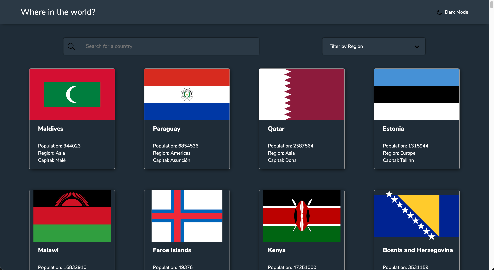
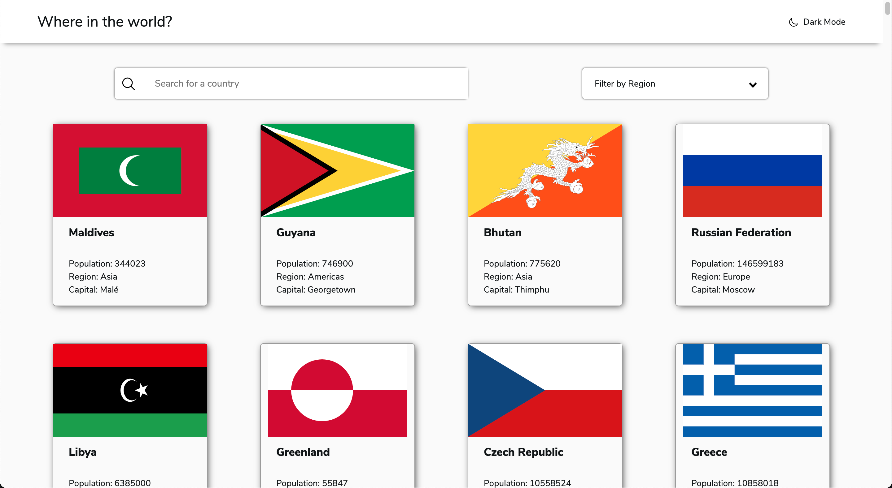

# Frontend Mentor - REST Countries API with color theme switcher solution

This is a solution to the [REST Countries API with color theme switcher challenge on Frontend Mentor](https://www.frontendmentor.io/challenges/rest-countries-api-with-color-theme-switcher-5cacc469fec04111f7b848ca). Frontend Mentor challenges help you improve your coding skills by building realistic projects.

## Table of contents

- [Overview](#overview)
  - [The challenge](#the-challenge)
  - [Screenshot](#screenshot)
  - [Links](#links)
- [My process](#my-process)
  - [Built with](#built-with)
  - [What I learned](#what-i-learned)
  - [Continued development](#continued-development)
  - [Useful resources](#useful-resources)
- [Author](#author)
- [Acknowledgments](#acknowledgments)

## Overview

### The challenge

Users should be able to:

- See all countries from the API on the homepage
- Search for a country using an `input` field
- Filter countries by region
- Click on a country to see more detailed information on a separate page
- Click through to the border countries on the detail page
- Toggle the color scheme between light and dark mode _(optional)_

### Screenshot





### Links

- Solution URL: [https://github.com/shreyasx/countries](https://github.com/shreyasx/countries)
- Live Site URL: [https://countriesofearth.netlify.app/](https://countriesofearth.netlify.app/)

## My process

### Built with

- [React](https://reactjs.org/) - JS library
- Mobile-first workflow
- Flexbox
- CSS custom properties
- Semantic HTML5 markup

### What I learned

The most challenging part making the theme-switcher. That is the reason why I chose this challenge in the first place.

This function here is to shuffle (randomize) the order of any array. I got bored looking at the same countries everytime I switched to my browser when coding, so I thought of adding this.

```js
const shuffleArray = array => {
	var currentIndex = array.length,
		randomIndex;
	while (0 !== currentIndex) {
		randomIndex = Math.floor(Math.random() * currentIndex);
		currentIndex--;
		[array[currentIndex], array[randomIndex]] = [
			array[randomIndex],
			array[currentIndex],
		];
	}
	return array;
};
```

### Useful resources

- [The easiest way to create a README](https://readme.so/) - This is a lifesaver. I'm forever gonna use this.
- [Box Shadow CSS Generator](https://cssgenerator.org/box-shadow-css-generator.html) - A very helpful tool to generate CSS shadows.

## Author

- Website - [Shreyas Jamkhandi](https://shreyasjamkhandi.tech/)
- Frontend Mentor - [@shreyasx](https://www.frontendmentor.io/profile/shreyasx)
